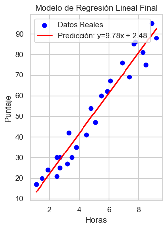
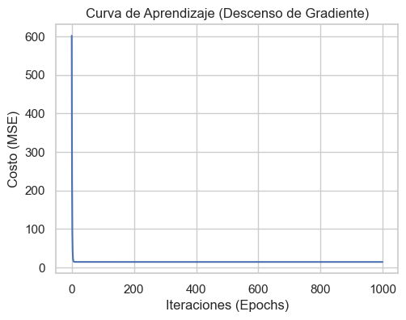

# 🎓 Student Score: Predicción de Rendimiento Académico

## 📖 Descripción del Proyecto
Este proyecto tiene como objetivo analizar la relación entre el **tiempo dedicado al estudio** y el **rendimiento académico**. 

A diferencia de implementaciones estándar, en este desafío se construyó un modelo de **Regresión Lineal Simple** implementando el algoritmo de **Descenso de Gradiente** desde cero (manualmente), sin depender de la lógica de entrenamiento de librerías de "caja negra". Esto permite comprender matemáticamente cómo la máquina minimiza la función de costo para encontrar la línea de mejor ajuste.

## 📂 Dataset y Análisis Exploratorio (EDA)
El set de datos consta de 25 registros con dos variables:
*   **$X$ (Hours):** Horas de estudio.
*   **$y$ (Scores):** Calificación obtenida.

**Hallazgos del EDA:**
*   **Correlación:** Se detectó una correlación de Pearson de **0.98**, indicando una relación lineal positiva casi perfecta.
*   **Calidad de Datos:** Ausencia total de *outliers* (valores atípicos) y una distribución limpia, lo que hace a este dataset ideal para modelos lineales.

## ⚙️ Metodología: Descenso de Gradiente
Se implementó el algoritmo iterativo para minimizar la función de costo (MSE).

*   **Learning Rate ($\alpha$):** 0.05
*   **Convergencia:** El costo inicial fue de **601.7** y descendió hasta estabilizarse en **14.44** antes de la iteración 200.

### Ecuación Resultante
El modelo encontró los siguientes parámetros óptimos:

$$ Score = 9.78 \cdot (Hours) + 2.48 $$

**Interpretación:**
1.  **Pendiente ($m \approx 9.78$):** Por cada hora adicional de estudio, el alumno aumenta su nota en casi **10 puntos**.
2.  **Intercepto ($b \approx 2.48$):** Un alumno que no estudie nada (0 horas) obtendría una nota base de 2.5 puntos.

## 📊 Visualización de Resultados

### 1. Ajuste del Modelo
La línea de regresión (roja) corta los datos minimizando la distancia cuadrática a los puntos reales.

### 2. Curva de Aprendizaje
Visualización de cómo el algoritmo de Descenso de Gradiente minimizó el error iteración tras iteración.

## 📉 Evaluación de Métricas

| Métrica | Valor | Interpretación |
| :--- | :--- | :--- |
| **$R^2$ (R-Cuadrado)** | **95.29%** | El modelo explica el 95% de la variabilidad de las notas basándose solo en las horas de estudio. |
| **RMSE** | **3.80** | El margen de error promedio de las predicciones es de +/- 3.8 puntos. |

## 🚀 Conclusiones
El experimento fue exitoso demostrando que:
1.  Existe una relación directa y cuantificable entre esfuerzo (tiempo) y resultado (nota).
2.  El algoritmo de **Descenso de Gradiente** implementado manualmente logró converger a una solución óptima con un error mínimo, validando la teoría matemática detrás de la regresión lineal.

---
**by:** Alejandro Barrenechea